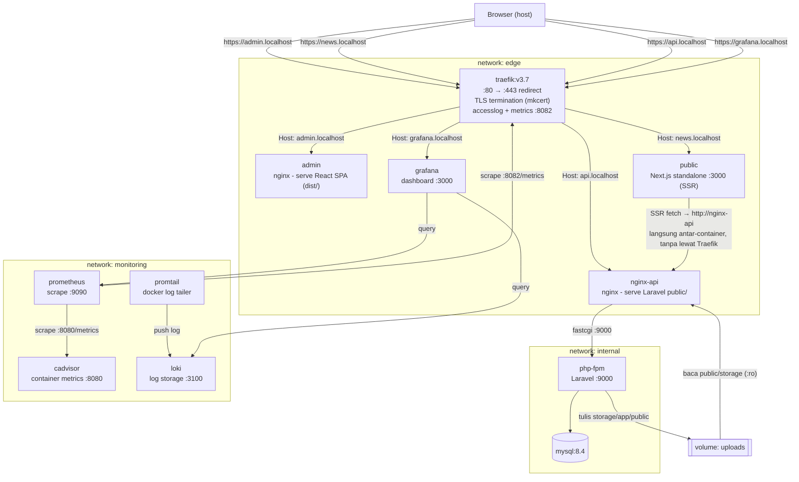
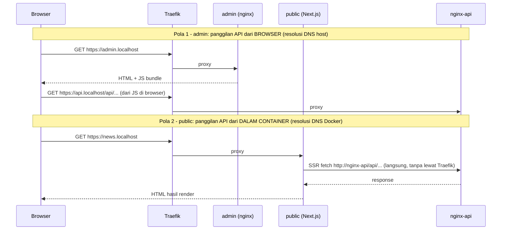

# Architecture - News Article Orchestration

Dokumen ini menjelaskan bentuk arsitektur yang sudah dibangun. Isinya hanya apa yang benar-benar sudah dikerjakan, bukan rencana. Rasional di balik tiap keputusan besar ada di [DECISION.md](DECISION.md).

---

## 1. File structure

Berkas orkestrasi yang relevan di repo ini:

```
news-article/
├── docker-compose.yml                                     service, network, volume
├── traefik/
│   └── dynamic/
│       └── tls.yml                                         sertifikat TLS untuk Traefik
├── monitoring/
│   ├── prometheus.yml                                      scrape config, filter cadvisor ke container proyek ini
│   ├── promtail-config.yml                                 docker log discovery
│   └── grafana/provisioning/
│       ├── datasources/datasources.yml                     datasource Prometheus + Loki otomatis
│       └── dashboards/                                     provider + dashboard "Orchestration overview" otomatis
├── scripts/
│   ├── checkout-versions.sh                                pin versi sibling repo
│   ├── verify.sh                                            verifikasi read-only
│   └── generate-traffic.sh                                 generator traffic HTTP untuk demo monitoring
└── certs/                                                   sertifikat TLS lokal, gitignored, digenerate per mesin
```

Dashboard dan query PromQL yang dipakai ada di [MONITORING.md](MONITORING.md).

Kode aplikasi ada di tiga repo sibling, bukan di sini (lihat README.md bagian 1).

## 2. Diagram

Seluruh jalur di diagram ini sudah terverifikasi bekerja, lihat [README.md](README.md) bagian 3 untuk daftar buktinya.



Traefik dipaksa memakai network `edge` untuk menghubungi backend (`--providers.docker.network`), karena `nginx-api` punya IP di dua network sekaligus (lihat §5). `traefik` dan `grafana` sama-sama dual-homed (`edge` + `monitoring`), pola yang sama dengan `nginx-api` (`edge` + `internal`): satu-satunya jembatan yang menghubungkan dua network yang saling terisolasi.

## 3. Two different API calling patterns

Panggilan API dari `admin` dan dari `public` menempuh jalur berbeda:



Konsekuensinya: kedua jalur butuh alamat API yang berbeda. Browser butuh hostname publik (`https://api.localhost`) yang di-resolve DNS host. Container butuh nama service Docker (`http://nginx-api`), karena DNS internal Docker tidak mengenal `api.localhost`.

Saat ini `NEXT_PUBLIC_API_BACKEND` berisi alamat internal, dan itu aman hanya karena seluruh pemakaiannya ada di `getServerSideProps`, tidak ada satu pun panggilan API dari browser di aplikasi `public`.

### The other direction: URLs returned by the API

Perbedaan dua dunia DNS di atas soal alamat yang dituju. Ada sisi lain yang sama pentingnya dan lebih mudah luput, karena baru muncul kalau API mengembalikan URL absolut.

Laravel membentuk URL absolut (`asset()`, link paginasi) dari host request. Karena dua pemanggil di atas datang dengan host berbeda (`api.localhost` dari browser lewat Traefik, `nginx-api` dari SSR), respons yang sama bisa berisi dua alamat berbeda tergantung siapa yang bertanya. Gejalanya jauh dari sebabnya: gambar artikel rusak di situs publik sementara di panel admin baik-baik saja.

Karena itu URL dipaksa berakar di `APP_URL` lewat `URL::forceRootUrl()` di `AppServiceProvider`, API ini punya satu alamat kanonik yang tidak bergantung pada siapa yang memanggil. Skemanya diurus terpisah di lapisan nginx (`fastcgi_param HTTPS on;`), karena TLS berhenti di Traefik dan request yang sampai ke aplikasi selalu HTTP biasa.

## 4. Components

| Service (compose) | Image basis | Peran | Network |
|---|---|---|---|
| `traefik` | `traefik:v3.7` | Reverse proxy, TLS termination, routing host-based | `edge` |
| `admin` | `node:20-alpine` (build) → `nginx:alpine` | Serve React SPA statis (`react-tailwind-roles`) | `edge` |
| `public` | `node:20-alpine` (build + runtime, standalone) | Next.js SSR (`nextjs-tailwind-storybook`) | `edge` |
| `nginx-api` | `nginx:alpine` | Serve `public/` Laravel statis, proxy `.php` ke `php-fpm` | `edge` + `internal` |
| `php-fpm` | `php:8.3-fpm-alpine` | Jalankan aplikasi Laravel (`laravel-swagger-roles`) | `internal` |
| `mysql` | `mysql:8.4` | Database | `internal` |
| `cadvisor` | `gcr.io/cadvisor/cadvisor:v0.49.1` | Metrics per-container (CPU/mem/network), baca dari Docker socket | `monitoring` |
| `prometheus` | `prom/prometheus:v3.0.1` | Scrape dan simpan metrics dari `traefik` + `cadvisor` | `monitoring` |
| `loki` | `grafana/loki:3.2.1` | Simpan log dari seluruh container | `monitoring` |
| `promtail` | `grafana/promtail:3.2.1` | Tarik `docker logs` semua container, kirim ke `loki` | `monitoring` |
| `grafana` | `grafana/grafana:11.3.1` | Dashboard, datasource dan dashboard "Orchestration overview" ter-provision otomatis | `monitoring` + `edge` |

Repo `news-article` tidak berisi kode aplikasi, tiap `build.context` di `docker-compose.yml` menunjuk ke repo sibling (`../laravel-swagger-roles`, `../react-tailwind-roles`, `../nextjs-tailwind-storybook`). Kelima service observability memakai image resmi langsung (bukan `build.context`), semuanya dipin ke digest manifest-list.

Lima named volume, semuanya menyimpan state yang tidak boleh ikut hilang saat container dibuat ulang:

| Volume | Dipakai oleh | Isi |
|---|---|---|
| `mysql-data` | `mysql` → `/var/lib/mysql` | Seluruh database |
| `uploads` | `php-fpm` → `storage/app/public` (tulis), `nginx-api` → `public/storage` (baca, `:ro`) | Gambar kategori dan artikel yang diunggah lewat panel admin |
| `prometheus-data` | `prometheus` → `/prometheus` | Time-series metrics |
| `loki-data` | `loki` → `/loki` | Log yang sudah diterima dari `promtail` |
| `grafana-data` | `grafana` → `/var/lib/grafana` | State Grafana (user, preferensi); datasource tetap di-provision ulang dari file, bukan disimpan di sini |

`uploads` di-mount di dua tempat karena yang menulis dan yang menyajikan adalah container berbeda. `php-fpm` wajib me-mount volume itu lebih dulu supaya kepemilikannya terbentuk sebagai `www-data`, bukan `root`, dijamin oleh `depends_on` di `nginx-api`.

## 5. Network segmentation

- **`edge`**: service yang boleh dijangkau lewat Traefik.
- **`internal`**: `php-fpm` dan `mysql`. Tidak pernah terhubung ke `edge`.
- **`monitoring`**: `cadvisor`, `prometheus`, `loki`, `promtail`. Tidak dipublish ke host maupun terhubung ke `internal`. Isolasinya searah: service monitoring boleh menjangkau apa yang mereka scrape (`traefik`, lewat dual-homing di bawah), tapi `internal` tidak pernah terhubung ke `monitoring`.
- **`nginx-api`** sengaja jadi satu-satunya service di `edge` + `internal`, sebagai jembatan. Request publik ke API selalu lewat nginx dulu, tidak ada jalur langsung ke `php-fpm` dari luar `internal`.
- **`traefik`** dan **`grafana`** sama-sama dual-homed di `edge` + `monitoring`, pola yang sama dengan `nginx-api`, untuk alasan berbeda: `traefik` perlu dijangkau `prometheus` untuk endpoint metrics-nya (`:8082`, tidak dipublish ke host), `grafana` perlu diroute Traefik supaya bisa diakses browser di `https://grafana.localhost`.

Pemisahan ini sudah diuji negatif: irisan daftar network `mysql`/`php-fpm` dengan `admin` terbukti kosong, dan menurut model network Docker dua container hanya bisa saling menjangkau kalau berbagi minimal satu network. Sekarang jadi cek tetap di `verify.sh` bagian 9.

Konsekuensi yang harus dijaga karena `nginx-api` berada di dua network sekaligus: Traefik wajib diberi tahu network mana yang dipakai, lewat `--providers.docker.network=news-article_edge`. Tanpa itu Traefik tidak dijamin memilih IP yang benar; begitu ia memilih IP `internal` (subnet yang tidak diikutinya), request menggantung sampai timeout, bukan ditolak, sehingga gejalanya jauh dari sebabnya.

Turunannya: nama network di-set eksplisit lewat `name:` di blok `networks`, supaya nilainya tidak ikut berubah kalau direktori project di-rename. Dan setiap service yang di-route Traefik wajib berada di `edge`, kalau tidak, Traefik tidak akan menemukannya.

## 6. Local TLS

Sertifikat digenerate manual: satu cert SAN untuk `news.localhost`, `admin.localhost`, `api.localhost`, `grafana.localhost`, disimpan di `certs/` yang di-gitignore, tidak ikut masuk repo maupun image. Traefik memuatnya lewat file provider (`traefik/dynamic/tls.yml`). Entrypoint `:80` redirect permanen (`308`) ke `:443`.

Karena `certs/` tidak ikut di-commit, environment baru wajib generate ulang sebelum stack bisa naik.

## 7. Build-time vs runtime config

Perbedaan yang gampang bikin salah tindakan saat ganti environment:

- **`php-fpm`**: konfigurasi (`DB_HOST`, `APP_URL`, dst.) masuk sebagai environment variable lewat `env_file:`, ditetapkan saat container dibuat, bukan saat start. Ganti config berarti edit `.env` di host, lalu `docker compose up -d --force-recreate php-fpm`. `docker compose restart` tidak berefek karena memakai ulang container yang sama.
- **`php-fpm`, catatan turunan**: `.env` masuk `.dockerignore`, jadi tidak ada file `.env` di dalam image. Perintah yang menulis ke file itu (`artisan key:generate` tanpa `--show`) tidak bisa dipakai.
- **`admin`** dan **`public`**: `VITE_BASE_URL` dan `NEXT_PUBLIC_API_BACKEND` di-inline Vite/Next.js ke bundle JavaScript saat build. Ganti target API berarti build ulang image dengan build arg baru, bukan sekadar ganti environment variable container. Hal yang sama berlaku untuk `next.config.mjs`, termasuk `images.unoptimized`.
- **Kode dan `config/` Laravel ikut masuk image saat build.** Mengubah `config/filesystems.php`, `app/Providers/AppServiceProvider.php`, atau `docker/nginx/default.conf` tidak berefek sampai image-nya di-build ulang, beda dari `.env` yang cukup `up -d --force-recreate`.

## 8. Known limitations

- **Tiga container memegang `/var/run/docker.sock`**: `traefik`, `cadvisor`, `promtail`. Semuanya read-only, tapi akses baca Docker socket setara akses root ke host. `traefik` butuh ini untuk `--providers.docker=true`, `cadvisor`/`promtail` untuk discovery container demi metrics/log. Belum ditriase.
- **`mysql` berjalan tanpa password root** (`MYSQL_ALLOW_EMPTY_PASSWORD=yes`), terbatas di network `internal`. Belum ditangani.
- **`nginx-api` bisa kalah balapan saat start.** `depends_on: php-fpm` hanya menunggu container start, bukan siap menerima koneksi, sedangkan nginx me-resolve host `php-fpm` saat startup dan langsung keluar kalau belum ada. `restart: unless-stopped` membuat kegagalan ini pulih sendiri, tapi balapannya sendiri belum dihilangkan. Penutupan sebenarnya butuh healthcheck di `php-fpm` plus `condition: service_healthy`.

## 9. Reproducing and verifying

`scripts/verify.sh` memeriksa ulang seluruh klaim di [README.md](README.md) bagian 3 tanpa mengubah keadaan (tidak build, tidak `up`, tidak `down`):

```bash
bash scripts/verify.sh
```

Cek yang gagal ditandai `[FAIL]` dan membuat exit code `1`. Seluruh cek yang menilai keadaan bersifat wajib, ketiga aplikasi sudah pernah terbukti `200`, jadi penurunan berikutnya memang regresi.

Penanda `[INFO]` tidak dihitung gagal dan dipakai untuk dua hal: pernyataan batas alat (script ini tidak menguji login maupun pembuatan kategori/artikel), dan keadaan yang memang belum terisi tapi bukan kerusakan (mis. belum ada kategori di database pada environment yang baru disiapkan, karena memang tidak ada seeder untuk kategori).

Batas yang perlu disadari saat membaca hasilnya: script ini memeriksa klaim yang bisa diperiksa tanpa mengubah keadaan. Yang tidak bisa diperiksa adalah tindakan yang mengubah keadaan: login dan pembuatan kategori/artikel. Langkahnya manual, ada di README.md bagian 5.

Untuk membangun stack dari nol, lihat [README.md](README.md) bagian 4.
