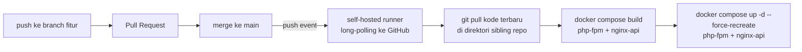

# Deployment

Mekanisme continuous deployment (CD) yang terimplementasi di sistem "News Article".

**Cakupan saat ini: hanya `laravel-swagger-roles` (API).** Dua repo lain (`react-tailwind-roles`, `nextjs-tailwind-storybook`) belum punya CD, keduanya masih dibangun manual lewat `docker compose build` di repo ini. Perluasan ke keduanya adalah langkah berikutnya, belum dikerjakan.

---

## 1. Design constraints

**Tidak ada VPS/cloud** (konsisten dengan seluruh sistem ini, lihat [DECISION.md](DECISION.md)). "Server produksi" adalah mesin lokal yang sama dipakai untuk pengembangan. Konsekuensinya, CD tidak mengirim kode ke tempat lain: yang terjadi adalah membangun ulang image dan menyalakan ulang container di mesin yang sama, dipicu otomatis oleh event dari GitHub.

**Migration database tidak termasuk otomasi.** `php artisan migrate` tetap dijalankan manual. Migration destruktif yang berjalan tanpa review manusia pada tiap push adalah risiko nyata, bukan hipotetis, jadi sengaja dikeluarkan dari cakupan CD.

## 2. Mechanism

CD berjalan lewat **GitHub Actions self-hosted runner**: proses yang terpasang di mesin lokal, melakukan long-polling ke GitHub (bukan menerima webhook masuk), sehingga tidak perlu membuka port apa pun di jaringan lokal. Runner terpasang sebagai systemd service, aktif terus di latar belakang.

Registrasi runner bersifat per-repo, bukan per-organisasi, karena ketiga repo aplikasi adalah repo personal, bukan di bawah GitHub Organization. Konsekuensinya, tiap repo yang ingin punya CD butuh runner terdaftar sendiri.

Runner dipasang di direktori terpisah, bukan di dalam checkout repo aplikasi manapun. Alasannya bukan preferensi kerapian: menaruh runner di dalam direktori yang punya `package.json` bertipe `"type": "module"` membuat proses internal runner gagal start (`ReferenceError: require is not defined in ES module scope`), bug Node.js yang sudah dikonfirmasi lewat issue tracker resmi `actions/runner`.

## 3. How it works



Job berjalan langsung di direktori sibling repo yang sama dipakai `build.context` di `docker-compose.yml` ([ARCHITECTURE.md](ARCHITECTURE.md) bagian 4), bukan di workspace terpisah milik runner (`actions/checkout` tidak dipakai). Pilihan ini menghindari duplikasi: kalau checkout jatuh ke workspace runner, `docker compose build` tetap membaca dari direktori sibling repo yang lama, bukan kode yang baru saja di-pull.

Dua service dibangun ulang dan direstart tiap deploy, `php-fpm` (aplikasi Laravel) dan `nginx-api` (menyajikan `public/` beserta konfigurasi nginx dari repo yang sama). Keduanya berasal dari Dockerfile yang sama di `laravel-swagger-roles`, jadi keduanya perlu ikut diperbarui, bukan cuma salah satu.

Rebuild `php-fpm` butuh token GitHub untuk Composer (`COMPOSER_AUTH`, disimpan sebagai GitHub Actions secret), supaya unduhan dependency tidak kena rate limit anonim GitHub yang mulai kena begitu build terjadi otomatis tiap merge, bukan cuma manual sesekali.

## 4. Git workflow

Kerja tetap di branch fitur, direview lewat pull request, baru merge ke `main`. Trigger CD (`push` ke `main`) sudah otomatis cocok dengan alur ini, merge menghasilkan push event ke `main`, itu yang memicu job.

Trigger sengaja **tidak** memakai event `pull_request`. Kalau dipicu dari situ, job bisa jalan di runner begitu PR dibuka, sebelum direview, itu justru celah keamanan utama self-hosted runner. Dengan trigger `push` ke `main`, job baru jalan setelah merge selesai.

## 5. Known limitations

- **Branch protection tidak bisa dipaksakan teknis.** GitHub Free untuk repo privat tidak menyediakan branch protection/ruleset (butuh Pro/Team/Enterprise). Alur branch → PR → merge berjalan atas disiplin manual, bukan aturan yang ditegakkan platform.
- **Tidak ada rollback otomatis** kalau build atau deploy gagal.
- **Tidak ada notifikasi** (Slack/email/dll) kalau job gagal, status dicek manual lewat tab Actions GitHub.
- **Registrasi runner manual sekali di awal**, tidak diotomasi lewat API.
- **Hanya mencakup satu repo.** Lihat catatan cakupan di atas.
- **Risiko self-hosted runner kalau repo publik.** Repo `laravel-swagger-roles` privat untuk sekarang. Kalau nanti dipublish, keputusan runner ini wajib ditinjau ulang: siapa pun yang fork bisa membuka PR, dan kalau trigger berubah ke `pull_request`, itu bisa mengeksekusi kode di runner. Trigger `push`-only di atas sudah menutup celah ini selama disiplin branch→PR→merge dijaga.

## 6. How to verify

```bash
gh run list --repo qrizan/laravel-swagger-roles --workflow deploy.yml --limit 5
docker compose ps php-fpm nginx-api
```

Job `Deploy` yang sukses di `gh run list` dan waktu `CREATED`/`STATUS` kedua container yang baru (cocok dengan waktu job selesai) membuktikan deploy benar-benar terjadi, bukan container lama yang masih menyala.
