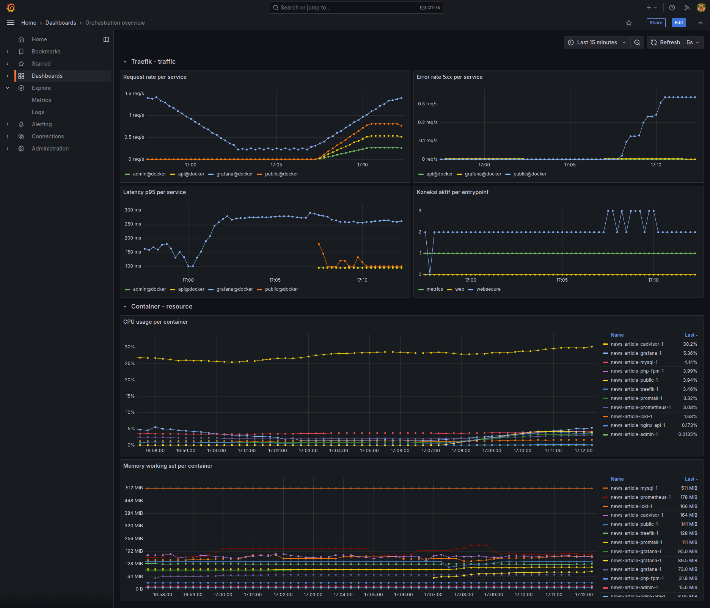

# MONITORING.md

Dashboard Grafana "Orchestration overview" (`monitoring/grafana/provisioning/dashboards/orchestration.json`), diprovisioning otomatis, berisi 6 panel dari dua sumber: metrik Traefik (traffic) dan metrik cAdvisor (resource container). Datanya diambil dari Prometheus yang sudah scrape kedua target ini.

## 1. Pendekatan

- **Traefik (edge traffic)**, metode RED: Rate, Errors, Duration.
- **Container (cAdvisor)**, metode USE: Utilization, Saturation.

## 2. Panel Traefik

| Panel | Metrik | PromQL |
|---|---|---|
| Request rate per service | `traefik_service_requests_total` | `sum(rate(traefik_service_requests_total[5m])) by (service)` |
| Error rate 5xx per service | `traefik_service_requests_total` | `sum(rate(traefik_service_requests_total{code=~"5.."}[5m])) by (service)` |
| Latency p95 per service | `traefik_service_request_duration_seconds_bucket` | `histogram_quantile(0.95, sum(rate(traefik_service_request_duration_seconds_bucket[5m])) by (le, service))` |
| Koneksi aktif per entrypoint | `traefik_open_connections` | `sum(traefik_open_connections) by (entrypoint)` |

Label `service` bernilai `api@docker`, `admin@docker`, `public@docker`, `grafana@docker`, sama dengan nama di label `traefik.http.services.*` pada `docker-compose.yml`.

## 3. Panel container

| Panel | Metrik | PromQL |
|---|---|---|
| CPU usage per container | `container_cpu_usage_seconds_total` | `sum(rate(container_cpu_usage_seconds_total{name!=""}[5m])) by (name)` |
| Memory working set per container | `container_memory_working_set_bytes` | `container_memory_working_set_bytes{name!=""}` |

`container_memory_working_set_bytes` dipakai, bukan `container_memory_usage_bytes`, karena working set adalah bagian memory yang tidak bisa direclaim tanpa memicu OOM, lebih representatif untuk kondisi tekanan memory dibanding usage mentah yang masih termasuk cache.

Kedua panel ini dibatasi Prometheus lewat `metric_relabel_configs` di `monitoring/prometheus.yml`, cuma menyimpan series dengan `name` berawalan `news-article-`. Tanpa filter ini, cAdvisor melaporkan seluruh container di host, termasuk container dari proyek lain yang kebetulan jalan di mesin yang sama.

Legend kedua panel pakai mode tabel, terurut dari nilai terakhir tertinggi ke terendah, supaya container paling boros langsung terlihat tanpa mencocokkan warna garis satu per satu.

## 4. Batasan

Network I/O per container tidak dipantau. cAdvisor cuma bisa memecah metrik network per container kalau jalan `privileged`, dan itu ditolak karena menambah attack surface signifikan (akses penuh ke device/namespace host) untuk satu panel. Metrik `container_network_receive_bytes_total`/`transmit` yang ada sekarang cuma agregat host (`id: "/"`), bukan per container, jadi tidak dipakai.

## 5. Screenshot

