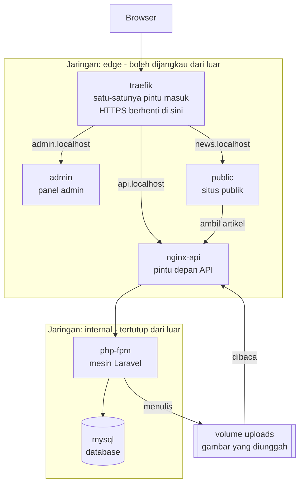
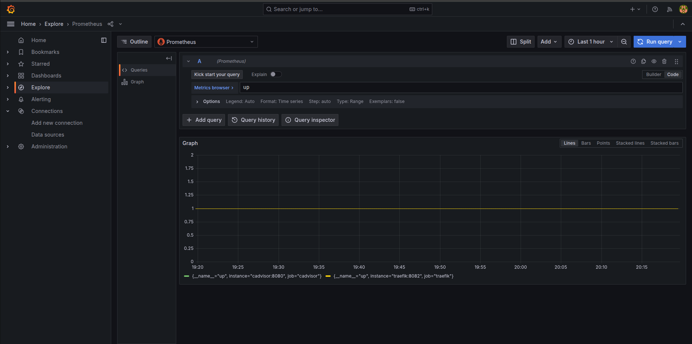
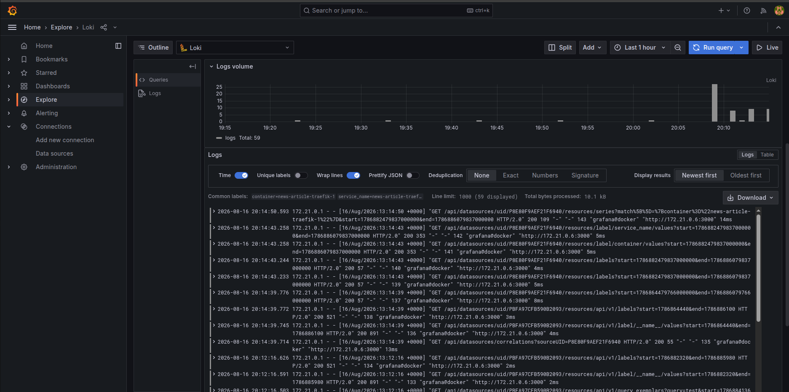

# News Article

Ringkasan sistem "News Article": apa yang dibangun, apa yang terbukti berjalan, dan cara menjalankannya.

---

## 1. What this is

Ada tiga aplikasi yang sebelumnya berdiri sendiri-sendiri:

| Aplikasi | Isinya |
|---|---|
| `laravel-swagger-roles` | API. Menyimpan artikel, user, dan hak akses. |
| `react-tailwind-roles` | Panel admin. Tempat mengelola user dan artikel. |
| `nextjs-tailwind-storybook` | Situs publik. Tempat pembaca membaca artikel. |

Ketiganya jalan terpisah di laptop, di port masing-masing, dan tidak saling terhubung.

Repo ini menyatukan ketiganya jadi satu sistem yang menyala dengan satu perintah. Repo ini tidak berisi kode aplikasi, hanya berkas yang mengatur bagaimana ketiganya dijalankan bersama.

Setelah menyala, empat alamat ini hidup di browser:

- `https://news.localhost`, situs publik
- `https://admin.localhost`, panel admin
- `https://api.localhost`, API
- `https://grafana.localhost`, dashboard observability (metrics + log), lihat bagian 2

---

## 2. System shape

Sebelas container berjalan bersamaan: enam untuk sistem inti (digambar di bawah), lima lagi untuk observability (dijelaskan di bagian akhir bab ini). Seluruh permintaan dari browser masuk lewat satu pintu, Traefik, yang meneruskan ke aplikasi sesuai alamat yang diminta.



Empat hal pokok dari diagram itu:

**Database tidak bisa dijangkau dari luar.** `mysql` dan `php-fpm` ditaruh di network tertutup. `nginx-api` satu-satunya service yang berdiri di dua network sekaligus, jadi satu-satunya jalan menuju database. Detail segmentasi network ada di [ARCHITECTURE.md](ARCHITECTURE.md) bagian 5.

**HTTPS-nya asli, bukan diakali.** Traefik memegang sertifikat yang dibuat `mkcert` dan sudah dipercaya oleh sistem operasi, browser tidak memunculkan peringatan. Alamat `http://` otomatis dialihkan ke `https://`.

**Gambar yang diunggah tinggal di volume bersama, bukan di dalam container.** Yang menulis gambar artikel adalah `php-fpm`, yang menyajikannya ke browser adalah `nginx-api`, dua container berbeda, berbagi satu volume bernama `uploads`.

**Situs publik mengambil artikel lewat jalur berbeda dari browser** (lihat bagian berikut).

### Five additional containers for observability

Network terpisah bernama `monitoring` berisi lima container: `prometheus` (metrics dari Traefik dan tiap container lewat `cadvisor`), `loki` dan `promtail` (log dari seluruh container), dan `grafana` (dashboard, satu-satunya dari kelimanya yang dijangkau lewat Traefik di `https://grafana.localhost`). Tidak ada yang menyentuh kode ketiga aplikasi, murni mengamati dari luar lewat Docker socket dan endpoint metrics.

### Why there are two API addresses

Panel admin memanggil API dari browser (`https://api.localhost`, resolusi DNS host). Situs publik memanggil API dari dalam container sebelum halaman dikirim ke browser (`http://nginx-api`, nama service Docker, karena DNS internal Docker tidak mengenal `api.localhost`). Salah memilih membuat situs publik gagal dengan `ENOTFOUND`. Detail kedua pola ini ada di [ARCHITECTURE.md](ARCHITECTURE.md) bagian 3.

---

## 3. What's proven

Dibuktikan dengan perintah nyata, dapat diulang kapan saja (caranya di bagian 5):

- Sebelas container menyala, database lolos pemeriksaan
- `http://` dialihkan ke `https://`
- Sertifikat keempat alamat dipercaya browser dan `curl`
- Ketiga alamat aplikasi menjawab `200`, permintaan sampai ke aplikasi yang benar
- Database terisi (migration + seeder), dan panel admin bisa di-login
- **Satu artikel dibuat dari panel admin dan muncul di situs publik, lengkap dengan gambarnya**

Butir terakhir menembus seluruh lapisan sekaligus: gambar artikel ditulis oleh container `php-fpm`, dilayani oleh container `nginx-api` yang berbeda, dirender oleh situs publik lewat panggilan internal antar-container, lalu dimuat browser lewat Traefik dengan TLS. Satu mata rantai putus, gambarnya tidak tampil.

- Sistem bisa direset total (`docker compose down -v`) lalu dibangun ulang dan diverifikasi otomatis (`scripts/bootstrap.sh` + `scripts/verify.sh`), tanpa langkah manual, aman diulang berkali-kali
- Database benar-benar tertutup dari jaringan luar, bukan sekadar dikonfigurasi
- Versi tiap komponen dipin (repo aplikasi ke commit, image dasar ke digest), dibuktikan dengan build ulang dari cache kosong yang tetap menghasilkan hasil yang sama
- Metrics dan log terkumpul nyata, bukan cuma servicenya menyala: Prometheus terbukti berhasil scrape Traefik dan tiap container, dan Loki terbukti menerima log dari seluruh container





- Dashboard Grafana terbentuk dari metrics dan log itu, bukan cuma datasource yang ter-provision, panel dan PromQL yang dipakai ada di [MONITORING.md](MONITORING.md)
- Push ke `main` di `laravel-swagger-roles` (API) memicu build dan redeploy otomatis tanpa intervensi manual, dibuktikan lewat run nyata, bukan cuma konfigurasi yang ada, detail di [DEPLOYMENT.md](DEPLOYMENT.md)

---

## 4. Running from scratch

Prasyarat: Docker, Docker Compose v2, dan `mkcert` yang sudah dipasang beserta CA lokalnya (`mkcert -install`).

Ketiga repo aplikasi harus berada sejajar dengan repo ini:

```
Projects/
├── news-article/              <- repo ini
├── laravel-swagger-roles/
├── react-tailwind-roles/
└── nextjs-tailwind-storybook/
```

### Step 0 - siapkan ketiga repo aplikasi

Clone ketiganya sejajar dengan repo ini kalau belum ada:

```bash
git clone git@github.com:qrizan/laravel-swagger-roles.git
git clone git@github.com:qrizan/react-tailwind-roles.git
git clone git@github.com:qrizan/nextjs-tailwind-storybook.git
```

Lalu pin dua repo frontend ke commit yang sudah terbukti bekerja bersama:

```bash
bash scripts/checkout-versions.sh
```

Hasil yang diharapkan: dua baris `[PASS]` (`react-tailwind-roles`, `nextjs-tailwind-storybook`), masing-masing dengan SHA commit yang di-checkout. Kalau ada `[FAIL]` karena salah satu repo punya perubahan belum di-commit, checkout-nya dilewati supaya tidak ada yang hilang, commit atau stash dulu perubahan itu, lalu ulangi.

`laravel-swagger-roles` sengaja tidak ikut dipin di sini, repo itu dikelola live oleh CD, jadi cukup di-clone pada commit `main` terbaru. Detail di [DEPLOYMENT.md](DEPLOYMENT.md).

### Step 1 - buat sertifikat HTTPS lokal

Dari dalam folder `news-article`:

```bash
mkdir -p certs && cd certs
mkcert news.localhost admin.localhost api.localhost grafana.localhost
cd ..
```

Hasil yang diharapkan: muncul dua berkas `news.localhost+3.pem` dan `news.localhost+3-key.pem` di dalam `certs/`.

### Step 2 - siapkan konfigurasi Laravel

```bash
cd ../laravel-swagger-roles
cp .env.example .env
cd ../news-article
```

Hasil yang diharapkan: berkas `.env` terbentuk. Isinya sudah diarahkan ke stack ini (`DB_HOST=mysql`, `APP_URL=https://api.localhost`), dengan `APP_KEY` dan `JWT_SECRET` masih kosong, keduanya diisi di langkah 4.

Langkah ini wajib. Tanpa `.env`, perintah di langkah 3 berhenti dengan error sebelum satu container pun dibuat.

### Step 3 - bangun dan nyalakan

Kembali di folder `news-article`:

```bash
docker compose build
docker compose up -d
docker compose ps
```

Hasil yang diharapkan: sebelas container berstatus `running`, dan `mysql` berstatus `healthy`.

### Step 4 - isi dua kunci rahasia

```bash
docker compose run --rm php-fpm php artisan key:generate --show
docker compose run --rm php-fpm php artisan jwt:secret --show
```

Kedua perintah itu mencetak nilai ke layar, tidak menyimpannya. Salin masing-masing nilai ke `.env` di `laravel-swagger-roles`, pada baris `APP_KEY=` dan `JWT_SECRET=`.

> **Kenapa harus `--show`.** Tanpa `--show`, kedua perintah itu menulis ke berkas `.env` di dalam container, dan berkas itu tidak ada di sana karena `.env` sengaja tidak ikut dimasukkan ke dalam image. Perintahnya akan gagal atau menulis ke tempat yang salah.

Setelah `.env` terisi, container harus dibuat ulang:

```bash
docker compose up -d --force-recreate php-fpm
```

> **Kenapa bukan `restart`.** Nilai dari `.env` dibaca satu kali saja, yaitu saat container dibuat. `docker compose restart` memakai ulang container yang sama, jadi tidak membaca `.env` yang baru.

### Step 5 - isi database

```bash
bash scripts/bootstrap.sh
```

Hasil yang diharapkan: tujuh migration `DONE`, lalu seeder membuat role, permission, dan satu akun administrator. Aman dijalankan ulang kapan saja: migration yang sudah jalan dilewati otomatis, dan seeder cuma dipanggil kalau database masih kosong.

Akun yang terbentuk (didefinisikan di `database/seeders/UserTableSeeder.php`):

- Email: `admin@example.com`
- Password: `qgURQ3+<`

Ganti password itu kalau sistem ini pernah dipakai di luar laptop sendiri.

---

## 5. Verify it yourself

Ada satu script yang memeriksa ulang seluruh klaim di bagian 3, tanpa mengubah apa pun, tidak membangun, tidak menyalakan, tidak mematikan:

```bash
bash scripts/verify.sh
```

Untuk menguji ulang dari kondisi benar-benar bersih, bukan cuma memeriksa keadaan yang sedang berjalan:

```bash
docker compose down -v
bash scripts/bootstrap.sh
bash scripts/verify.sh
```

`down -v` menghapus seluruh volume (database, upload, data monitoring). `bootstrap.sh` membangun ulang database dari kosong sampai siap (lihat Step 5). Satu siklus, aman diulang berkali-kali.

Script itu memeriksa: perkakas yang dibutuhkan ada, sertifikat ada, konfigurasi compose sah, enam container menyala, pengalihan `http` ke `https` bekerja, sertifikat ketiga alamat dipercaya, ketiga aplikasi menjawab `200`, API menjawab di endpoint datanya, URL yang dikeluarkan API berakar di `https://api.localhost`, gambar unggahan benar-benar dilayani, dan database tidak bisa dijangkau dari jaringan luar.

Setiap baris ditandai `[PASS]` atau `[FAIL]`, diakhiri rekapitulasi. Kalau ada satu saja yang `[FAIL]`, script keluar dengan kode `1`.

Yang tidak bisa diperiksa script itu adalah tindakan yang mengubah keadaan, yaitu login dan pembuatan kategori/artikel. Batas itu dinyatakan terbuka di keluarannya. Pembuktiannya dilakukan manual setelah langkah 5:

1. Login ke `https://admin.localhost` dengan akun di atas
2. Kategori lalu artikel dibuat dari panel admin, keduanya mewajibkan unggah gambar
3. Artikel muncul di `https://news.localhost` beserta gambarnya

Ketiga langkah ini sudah pernah dilakukan dan berhasil, dapat diulang kapan saja untuk verifikasi independen. Gambar pada langkah 3 membuktikan berkas hasil unggahan benar-benar melintasi batas container, bukan sekadar tersimpan di suatu tempat.

---

## 6. Known limitations

Temuan keamanan yang belum diperbaiki: Laravel 10 EOL, CVE kritis pada `next` (CVE-2025-29927), dan dua CVE kritis npm di `react-tailwind-roles`. Mekanisme pemeriksaannya (dependency scan, static analysis, container/config scan, secret scan) ada di [SECURITY.md](SECURITY.md).

Celah infrastruktur yang belum ditangani: akses baca Docker socket di tiga container, dan `mysql` tanpa password root. Detail dan konsekuensinya ada di [ARCHITECTURE.md](ARCHITECTURE.md) bagian 8.

Metrics dan log sudah dikumpulkan (Prometheus, Loki, Grafana), tracing lintas layanan belum dikerjakan, rasionalnya ada di [DECISION.md](DECISION.md).

Sistem ini belum pernah dijalankan dari nol di mesin lain oleh pihak lain.

---

## 7. Other documents

Berkas berikut bukan bacaan wajib untuk memahami proyek ini, dibuka sesuai kebutuhan.

| Berkas | Dibuka kalau ingin tahu |
|---|---|
| [ARCHITECTURE.md](ARCHITECTURE.md) | Detail teknis bentuk sistem, lebih dalam dari bagian 2 |
| [DECISION.md](DECISION.md) | Kenapa sesuatu diputuskan begitu, bukan cara lain |
| [SECURITY.md](SECURITY.md) | Mekanisme pemeriksaan keamanan otomatis, tool per lapisan, kebijakan gating, keterbatasan yang diketahui |
| [MONITORING.md](MONITORING.md) | Panel dashboard Grafana, metrik dan PromQL yang dipakai, keterbatasan monitoring saat ini |
| [DEPLOYMENT.md](DEPLOYMENT.md) | Mekanisme continuous deployment, self-hosted runner, alur branch-PR-merge, keterbatasan yang diketahui |
