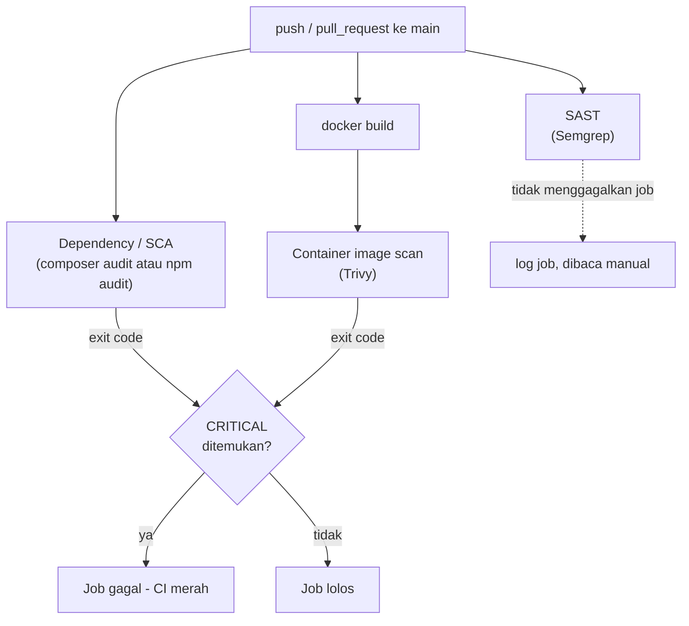

# Security - News Article

Mekanisme keamanan yang terimplementasi di sistem "News Article": empat repo (orkestrasi ini + `laravel-swagger-roles`, `react-tailwind-roles`, `nextjs-tailwind-storybook`), masing-masing punya pipeline CI security sendiri di GitHub Actions.

---

## 1. Design constraints

**Tidak ada deployment cloud/VPS.** Pipeline security yang dijelaskan di dokumen ini berhenti di `build + test + security scan`, tidak ada stage deploy. CD berjalan sebagai workflow terpisah, di luar cakupan dokumen ini, saat ini hanya untuk `laravel-swagger-roles`, lihat [DEPLOYMENT.md](DEPLOYMENT.md).

## 2. Scanning layers

| Lapisan | Tool | Repo | Yang di-scan |
|---|---|---|---|
| Dependency / SCA - PHP | `composer audit` | `laravel-swagger-roles` | `composer.lock` vs advisory database |
| Dependency / SCA - JS | `npm audit` | `react-tailwind-roles`, `nextjs-tailwind-storybook` | `package-lock.json` vs advisory database |
| SAST | Semgrep (Community/OSS) | ketiga repo aplikasi | source code, pattern-based static analysis |
| Container image scan | Trivy (`aquasecurity/trivy-action`) | ketiga repo aplikasi | image hasil `docker build`, OS packages, dependency lockfile yang ikut ter-bundle, binari yang membawa runtime lain |
| Config / misconfiguration scan | Trivy (`scan-type: config`) | repo ini (`news-article`) | `docker-compose.yml`, `traefik/dynamic/` |
| Secret scanning | `gitleaks` (image resmi, dipanggil langsung) | keempat repo | seluruh working tree hasil checkout |
| Supply chain - versi/digest | Dependabot | keempat repo | `Dockerfile` (ecosystem `docker`), `docker-compose.yml` (ecosystem `docker-compose`, khusus repo ini), aksi GitHub yang dipakai (`github-actions`) |

Semua job jalan otomatis lewat trigger `push`/`pull_request` ke `main` plus `workflow_dispatch` manual. Dependabot menambah trigger `pull_request` sendiri tiap kali membuka PR bump versi.

## 3. Pipeline flow per repo



Repo `news-article` tidak punya tahap `build`/`docker build` di alurnya sendiri, Dockerfile ada di tiga repo aplikasi, bukan di sini. Alurnya lebih pendek: `push`/`pull_request` ke Trivy config-scan langsung atas `docker-compose.yml` + `traefik/`.

## 4. Gating policy

Trivy (image scan dan config scan) dan `npm audit` diset menggagalkan job hanya untuk temuan tingkat `CRITICAL`. Temuan `HIGH` ke bawah tetap muncul di output job, tapi tidak menghentikan pipeline.

`composer audit` di `laravel-swagger-roles` tidak ikut kebijakan ini, tool ini tidak punya cara filter severity yang terverifikasi, jadi tetap menggagalkan job untuk advisory apa pun yang ditemukan.

## 5. Known limitations

- Semgrep berjalan di setiap repo aplikasi, tapi belum menggagalkan job untuk temuan apa pun. Hasilnya tercatat di log job, dibaca manual.
- Tidak ada agregasi lintas-repo. Tiap repo melapor sendiri lewat tab Actions atau `gh run list`/`gh run view`.
- Tidak ada DAST (dynamic application security testing). Seluruh scanning di sini statis: kode, lockfile, image, config.
- Digest base image beku sampai Dependabot mengajukan PR bump versi. PR-nya tetap perlu direview dan di-merge manual.

## 6. How to verify

```bash
gh run list --repo qrizan/<repo> --workflow security.yml --limit 5
gh run view <run-id> --repo qrizan/<repo> --log-failed
```

Ganti `<repo>` dengan salah satu dari `laravel-swagger-roles`, `react-tailwind-roles`, `nextjs-tailwind-storybook`, `news-article`.
